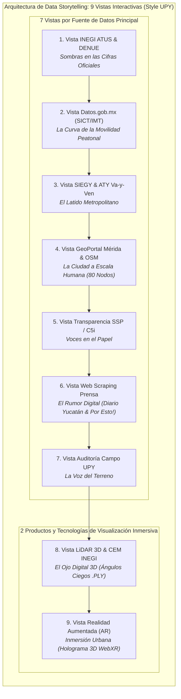
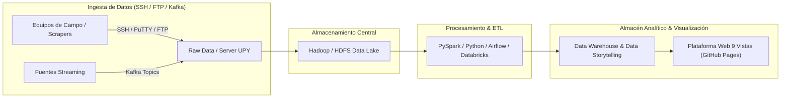

# Data Storytelling: Sentir la Calle (El Viaje Peatonal, Seguridad y Confort Urbano en Mérida)

## Resumen Ejecutivo de la Arquitectura de Visualización

Este documento define la metodología y procedencia de datos para el proyecto **Data Storytelling Interactivo** enfocado en la movilidad peatonal, accesibilidad universal y confort térmico en Mérida, Yucatán. La plataforma adopta una estructura modular en la cual el usuario navega a través de **9 Vistas / Pestañas Temáticas**:
- **7 Vistas guiadas por Fuentes de Datos Principales** (institucionales, de datos abiertos, hemerográficas y primarias de campo).
- **2 Productos y Tecnologías de Visualización Inmersiva** (**LiDAR 3D** y **Realidad Aumentada - AR WebXR**), que permiten inspeccionar volumétricamente los datos espaciales y proponer soluciones urbanas.

---

---

## 1. Matriz de las 9 Vistas de Visualización y Procedencia de Datos

| No. | Nombre de la Vista | Fuente Principal (Origen) | Fuentes Secundarias de Apoyo | Tipo de Visualización Compleja | Eje de Storytelling |
| :---: | :--- | :--- | :--- | :--- | :--- |
| **1** | **Módulo INEGI ATUS & DENUE** | **INEGI** (ATUS Accidentes & DENUE 2020) | Microdatos ATUS Mérida, DENUE Cruces, Censo Manzanas | **Explorador Cartográfico Multiescalar con Clusters Dinámicos** | *Sombras en las Cifras Oficiales:* Radiografía de 7,134 percances en zonas comerciales expuestas. |
| **2** | **Módulo Datos.gob.mx** | **Datos.gob.mx** (SICT Datos Viales & IMT Red Caminos) | Base Viales Abiertos SICT, Registro Movilidad | **Diagrama de Sankey Dinámico + Curvas de Tendencia** | *La Curva de la Movilidad:* Flujos peatonales vs. tasa de motorización en la red vial. |
| **3** | **Módulo SIEGY Yucatán** | **SIEGY Yucatán & ATY** (Rutas y Paraderos Va-y-Ven) | Traza Va-y-Ven ATY, Cohesión SIEGY, Matriz Periférico | **Radar Multidimensional & Mapa de Paraderos Va-y-Ven** | *El Latido Metropolitano:* Tiempos de caminata a paraderos y cobertura de sombra metropolitana. |
| **4** | **Módulo GeoPortal Mérida** | **GeoPortal Mérida & OpenStreetMap** (API Overpass 80 Nodos) | Capa GIS Banquetas, Inventario Semáforos, 80 Nodos OSM | **Mapa Cartográfico Interactivo Leaflet de 80 Nodos** | *La Ciudad a Escala Humana:* Tiempos verdes en semáforos (14 seg promedio) y velocidad de cruce. |
| **5** | **Módulo Transparencia (PNT)** | **Transparencia / SSP Yucatán & C5i** | Informes C5i Radares/Semáforos, Solicitudes PNT | **Raincloud Plots & Matriz de Respuestas Institucionales** | *Voces en el Papel:* Documentación pública de infraestructura de seguridad vial, radares y solicitudes de vecinos. |
| **6** | **Módulo Web Scraping** | **Web Scraping Prensa Local** (Diario de Yucatán, Por Esto!) | Scraping Diario Yucatán, Mining Por Esto!, Redes #Periférico | **Red de Co-ocurrencia Semántica (D3 Force) & Sentimiento** | *El Rumor Digital:* Minería semántica de notas periodísticas locales y análisis de percepción. |
| **7** | **Módulo Auditoría Campo UPY** | **Datos Primarios UPY** (Auditoría presencial a pie) | Conteo Afluencia Hora Pico, Ancho Libre (Umbral 1.2m), Exposición Térmica | **Calculadora de Huella Peatonal & Medidor Térmico** | *La Voz del Terreno:* Mediciones a pie sobre ancho libre de circulación y registros térmicos (hasta 38.5°C). |
| **8** | **Módulo LiDAR 3D** | *INEGI Continuo Elevación (CEM) + Escaneo Aula 1:50* | Nube Puntos .PLY, Detección Ángulo Ciego (3.5m), Rampas | **Maqueta 3D Volumétrica Interactiva (Three.js WebGL)** | *El Ojo Digital 3D:* Simulación láser del cono de visión de conductores y bloqueo visual por elementos urbanos. |
| **9** | **Módulo Realidad Aumentada (AR)**| *Tecnología WebXR / Modelado 3D* | Modelo Holográfico 3D, Filtro AR WebXR, Matriz Integrada | **Holograma Interactivo 3D y Experiencia WebXR en AR** | *Inmersión Urbana:* Proyección en Realidad Aumentada de un cruce re-diseñado sobre el escritorio. |

---

## 2. Detalle Metodológico de Procedencia de Datos

### Vista 1: Sombras en las Cifras Oficiales (INEGI ATUS & DENUE)
- **Fuente Principal:** INEGI ATUS (Accidentes de Tránsito Terrestre) y DENUE 2020 (`inegi.org.mx`).
- **Procedencia:** Registros administrativos oficiales de accidentes viales urbanos y unidades económicas georeferenciadas.
- **Visualización:** Explorador cartográfico Leaflet con cluster dinámico y mapa de calor.

### Vista 2: La Curva de la Movilidad Peatonal (Datos.gob.mx - SICT/IMT)
- **Fuente Principal:** Datos.gob.mx (Datos Viales SICT e Instituto Mexicano del Transporte IMT).
- **Procedencia:** Datos abiertos del Gobierno Federal sobre volumen de tránsito y Red Nacional de Caminos.
- **Visualización:** Diagrama de Sankey interactivo y curvas de tendencia temporal.

### Vista 3: El Latido Metropolitano (SIEGY Yucatán & ATY Va-y-Ven)
- **Fuente Principal:** SIEGY (Sistema de Información Estadística y Geográfica de Yucatán) y Agencia de Transporte de Yucatán (ATY).
- **Procedencia:** Indicadores de cohesión territorial y datos de la red de transporte Va-y-Ven.
- **Visualización:** Radar multidimensional y mapa interactivo de paraderos y tiempos de espera.

### Vista 4: La Ciudad a Escala Humana (GeoPortal Mérida & OpenStreetMap)
- **Fuente Principal:** GeoPortal del Ayuntamiento de Mérida y OpenStreetMap Overpass API.
- **Procedencia:** Capas GIS municipales y extracción de 80 nodos semaforizados (`highway=traffic_signals`) en la Zona Metropolitana de Mérida.
- **Visualización:** Mapa Leaflet interactivo con fichas de tiempos verdes y velocidad de cruce requerida.

### Vista 5: Voces en el Papel (Transparencia PNT & SSP Yucatán / C5i)
- **Fuente Principal:** Información pública de la SSP Yucatán, informes del C5i (cámaras/radares) y solicitudes de transparencia PNT.
- **Procedencia:** Documentación oficial sobre infraestructura de seguridad vial y peticiones de vecinos.
- **Visualización:** Raincloud Plot y distribución de tiempos de atención gubernamental.

### Vista 6: El Rumor Digital (Web Scraping Prensa Local)
- **Fuente Principal:** Corpus hemerográfico de prensa digital local (*Diario de Yucatán*, *Por Esto!*).
- **Procedencia:** Minería hemerográfica secundaria para análisis de PLN, co-ocurrencia semántica y percepción.
- **Visualización:** Grafo interactivo de física de fuerzas D3 y matriz de sentimiento.

### Vista 7: La Voz del Terreno (Auditoría de Campo UPY)
- **Fuente Principal:** Datos primarios recolectados en campo por el equipo de estudiantes UPY.
- **Procedencia:** Medición directa a pie de ancho libre de circulación (evaluado contra el umbral de referencia de 1.20 m de accesibilidad universal) y registros térmicos de exposición solar (con mediciones en pavimento de hasta 38.5 °C).
- **Visualización:** Calculadora de huella peatonal y medidor térmico.

### Vista 8: El Ojo Digital 3D (LiDAR 3D & Continuo de Elevaciones INEGI)
- **Fuente Principal:** Continuo de Elevaciones Mexicano (INEGI CEM) y escaneo volumétrico láser experimental de maqueta 1:50 en aula.
- **Procedencia:** Nube de puntos 3D (.PLY / .XYZ) procesada para detección de ángulos ciegos de visión vehicular (3.5m).
- **Visualización:** Lienzo 3D WebGL con Three.js y OrbitControls.

### Vista 9: Inmersión Urbana (Realidad Aumentada WebXR)
- **Tecnología:** Entorno WebXR para Realidad Aumentada y modelado 3D de rediseño urbano.
- **Función:** Producto de síntesis visual e interacción volumétrica que permite proyectar la propuesta de crucero seguro en AR sobre la mesa del usuario.
- **Visualización:** Holograma 3D interactivo con despiece de elementos de protección peatonal.

---

## 3. Pipeline de Procesamiento Enterprise Data Lake

