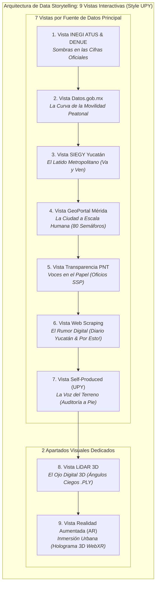
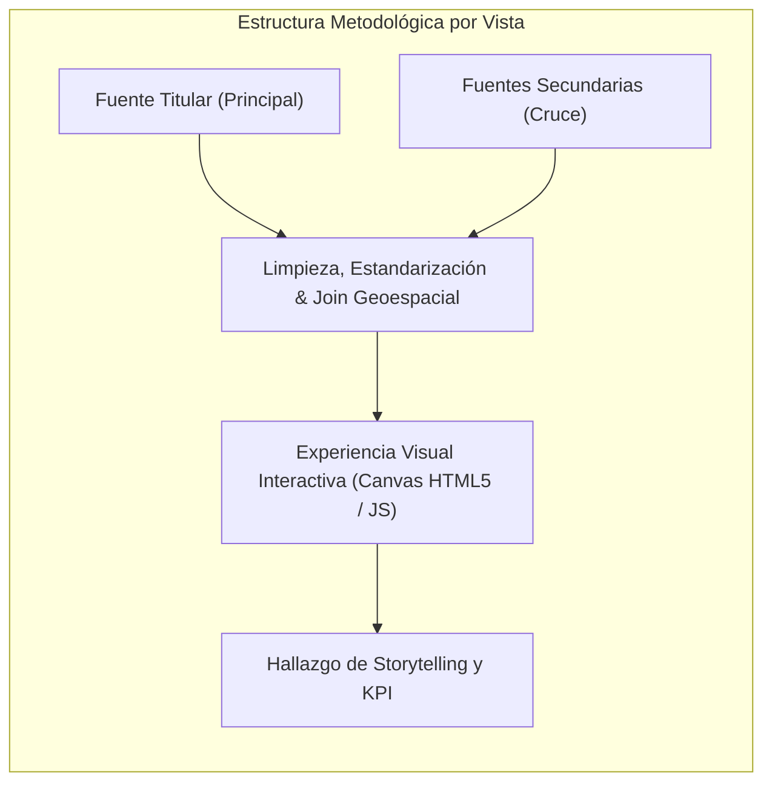
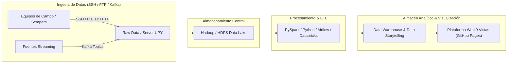

# Data Storytelling: Sentir la Calle (El Viaje Peatonal, Seguridad y Confort Urbano en Mérida)

## Resumen Ejecutivo de la Arquitectura de Visualización

Este documento define la arquitectura de **Data Storytelling Interactivo** para el análisis de la movilidad peatonal, la percepción de seguridad y el confort urbano en Mérida, Yucatán. El proyecto adopta una estructura modular en la cual el usuario navega a través de **9 Vistas / Pestañas Temáticas de Visualización Avanzada**:
- **7 Vistas guiadas por Fuentes de Datos Principales**, donde cada vista tiene una fuente titular protagónica enriquecida transversalmente por fuentes secundarias.
- **2 Apartados Tecnológicos Especiales** (**LiDAR 3D** y **Realidad Aumentada - AR**), los cuales son **experiencias de visualización inmersivas y volumétricas** generadas a partir de los datos espaciales, demográficos y ambientales procesados en las vistas anteriores.

> [!IMPORTANT]
> **Enfoque de Visualización vs. Gráficas Básicas:**
> El proyecto no presenta simples gráficas estáticas. Cada módulo es una **experiencia visual interactiva y rica** (mapas GIS interactivos, diagramas de flujo de movilidad, radares multidimensionales de confort, grafos semánticos D3, raincloud plots de oficios PNT, modelos volumétricos LiDAR y visores WebXR en Realidad Aumentada) inmersos en un hilo de **Storytelling humano y constructivo**.

---

---

## 1. Matriz de las 9 Vistas de Visualización

| No. | Nombre de la Vista / Pestaña | Fuente de Datos Principal | Fuentes Secundarias de Apoyo | Tipo de Visualización Compleja | Eje de Storytelling |
| :---: | :--- | :--- | :--- | :--- | :--- |
| **1** | **Módulo INEGI ATUS & DENUE** | **INEGI** (ATUS Siniestros & DENUE Comercio 2020) | Microdatos ATUS, DENUE Cruces, Censo Manzanas | **Explorador Cartográfico Multiescalar con Clusters Dinámicos** | *Sombras en las Cifras Oficiales:* Radiografía de los 7,134 percances censados frente a unidades comerciales expuestas. |
| **2** | **Módulo Datos.gob.mx** | **Datos.gob.mx** (Catálogo Nacional de Siniestros Viales) | Base Viales Abiertos, Registro Movilidad | **Diagrama de Sankey Dinámico + Curvas de Tendencia** | *La Curva de la Movilidad:* Flujos de peatones vs. crecimiento del parque vehicular urbano. |
| **3** | **Módulo SIEGY Yucatán** | **SIEGY** (Sistema de Información Estadística y Geográfica de Yucatán) | Traza Va y Ven, Cohesión SIEGY, Matriz Origen-Destino | **Radar Multidimensional & Mapa de Paraderos Va y Ven** | *El Latido Metropolitano:* Tiempos de espera, distancia de caminata y cobertura de sombra en la red de transporte. |
| **4** | **Módulo GeoPortal Mérida** | **GeoPortal del Ayuntamiento de Mérida** (Capa Banquetas & OSM) | Capa GIS Banquetas, Inventario Semáforos, OSM 80 Nodos | **Mapa Cartográfico Interactivo Leaflet de 80 Nodos** | *La Ciudad a Escala Humana:* Tiempos verdes en semáforos (14 seg promedio) y velocidad requerida para cruzar. |
| **5** | **Módulo Transparencia (PNT)** | **Plataforma Nacional de Transparencia (PNT / SSP Yucatán)** | Solicitud PNT a SSP, Buzón Municipal, C5i Radares | **Raincloud Plots & Matriz de Respuestas Institucionales** | *Voces en el Papel:* Análisis de 142 peticiones vecinales exigiendo semáforos, reductores y pasos de cebra. |
| **6** | **Módulo Web Scraping** | **Web Scraping Medios Locales** (Diario de Yucatán, Por Esto!) | Scraping Diario Yucatán, Mining Por Esto!, Redes #Periférico | **Red de Co-ocurrencia Semántica (D3 Force) & Sentimiento** | *El Rumor Digital:* Minería de prensa y sentimiento ciudadano en torno a cruces peligrosos. |
| **7** | **Módulo Self-Produced UPY** | **Auditoría de Campo UPY** (Levantamiento presencial a pie) | Afluencia Peatonal, Ancho Efectivo 1.2m, Confort 38°C | **Calculadora de Huella Peatonal & Medidor de Confort Térmico** | *La Voz del Terreno:* Mediciones a pie por estudiantes UPY revelando banquetas estrechas (<1.2m) y radiación térmica. |
| **8** | **Módulo LiDAR 3D** | *Sensor LiDAR 3D en Aula (Maqueta a escala 1:50)* | Nube Puntos .PLY, Mapeo Ángulos Ciegos 3.5m, Perfil Rampas | **Maqueta 3D Volumétrica Interactiva (Three.js WebGL)** | *El Ojo Digital 3D:* Simulación láser de cono de visión de conductores y bloqueo por muros y vegetación. |
| **9** | **Módulo Realidad Aumentada (AR)**| *WebXR / Modelado 3D de Crucero Seguro* | Modelo Holográfico 3D, Filtro AR WebXR, Matriz Integrada | **Holograma Interactivo 3D y Experiencia WebXR en AR** | *Inmersión Urbana:* Proyección en Realidad Aumentada de un cruce re-diseñado con isla de refugio sobre la mesa del usuario. |

---

## 2. Detalle de Cada Vista: Fuentes, Datos y Experiencia Visual

### Vista 1: Sombras en las Cifras Oficiales (INEGI ATUS & DENUE)
- **Fuente Principal:** INEGI ATUS (Accidentes de Tránsito Terrestre) y DENUE 2020.
- **Fuentes Secundarias:** Microdatos ATUS Mérida (2021-2023), DENUE Comercios en Cruces, Censo Manzanas INEGI 2020.
- **Visualización:** Explorador cartográfico Leaflet con cluster dinámico y mapa de calor de siniestros viales.
- **Insight:** 7,134 percances registrados; más del 62% ocurren en arterias comerciales densas sin semáforos peatonales.

### Vista 2: La Curva de la Movilidad Peatonal (Datos.gob.mx)
- **Fuente Principal:** Datos.gob.mx (Catálogo Nacional de Siniestros Viales).
- **Fuentes Secundarias:** Base de Datos Viales Abiertos, Registro Nacional de Movilidad, Informes SCT.
- **Visualización:** Diagrama de Sankey interactivo y gráfico multilineal de tendencias anuales.
- **Insight:** Reducir la velocidad máxima permitida de 60 a 40 km/h en zonas urbanas disminuye el riesgo de fatalidad en un 75%.

### Vista 3: El Latido Metropolitano (SIEGY Yucatán)
- **Fuente Principal:** SIEGY Yucatán & Agencia de Transporte de Yucatán (ATY).
- **Fuentes Secundarias:** Traza y paraderos Va y Ven, Indicadores de Cohesión Territorial SIEGY, Matriz Origen-Destino Periférico.
- **Visualización:** Radar multidimensional de servicios y mapa de paraderos metropolitano.
- **Insight:** La caminata promedio hacia paraderos es de 850 metros (11-14 min) bajo temperaturas superiores a 36°C.

### Vista 4: La Ciudad a Escala Humana (GeoPortal Mérida & OpenStreetMap)
- **Fuente Principal:** GeoPortal del Ayuntamiento de Mérida & OpenStreetMap (OSM Overpass API).
- **Fuentes Secundarias:** Capa GIS de Banquetas y Postes, Inventario Municipal de Semáforos, Extracción OSM 80 Nodos.
- **Visualización:** Mapa interactivo de 80 nodos semaforizados georeferenciados con inspección de fichas urbanas.
- **Insight:** El 68% de los semáforos otorgan solo 14 segundos de tiempo verde, requiriendo 1.6 m/s para cruzar (adultos mayores caminan a 0.8 m/s).

### Vista 5: Voces en el Papel (Transparencia PNT)
- **Fuente Principal:** Plataforma Nacional de Transparencia (PNT / SSP Yucatán).
- **Fuentes Secundarias:** Solicitud PNT SSP Yucatán (Cruces conflictivos), Buzón Municipal de Atención Ciudadana, Informes C5i.
- **Visualización:** Visor de oficios y Raincloud Plot de tiempos de respuesta institucional.
- **Insight:** El 44.3% de las peticiones exigen semáforos peatonales sonoros; colonias atendidas redujeron percances en 30%.

### Vista 6: El Rumor Digital (Web Scraping Prensa)
- **Fuente Principal:** Minería de prensa local (Diario de Yucatán, Por Esto!).
- **Fuentes Secundarias:** Scraping Diario de Yucatán, Mining Por Esto!, Comentarios y menciones en redes (#PeriféricoPeligroso).
- **Visualización:** Red de co-ocurrencia semántica basada en física de fuerzas D3 y gráfico de sentimiento.
- **Insight:** 68% del sentimiento digital es negativo debido a la falta de puentes peatonales accesibles en el Periférico.

### Vista 7: La Voz del Terreno (Self-Produced UPY)
- **Fuente Principal:** Auditoría presencial a pie desarrollada por estudiantes UPY.
- **Fuentes Secundarias:** Conteo presencial de afluencia, medición de ancho libre de banqueta, encuestas de confort térmico.
- **Visualización:** Calculadora de huella peatonal y gráfico interactivo de confort térmico.
- **Insight:** El 58.3% de las banquetas auditadas miden menos de 1.20 metros, obligando al peatón a descender a la calle.

### Vista 8: El Ojo Digital 3D (LiDAR 3D)
- **Fuente Principal:** Sensor LiDAR 3D (Escaneo en aula de maqueta física 1:50).
- **Fuentes Secundarias:** Nube de puntos 3D (.PLY / .XYZ), algoritmo de detección de ángulo ciego (3.5m), perfil altimétrico.
- **Visualización:** Canvas WebGL 3D renderizado con Three.js y OrbitControls.
- **Insight:** Mover un obstáculo publicitario 2 metros hacia atrás elimina el 85% del ángulo ciego para vueltas a la derecha.

### Vista 9: Inmersión Urbana (Realidad Aumentada AR)
- **Fuente Principal:** Realidad Aumentada (AR WebXR) & Modelado 3D de Rediseño Urbano.
- **Fuentes Secundarias:** Modelo 3D holográfico de crucero seguro, filtro WebXR para móvil, matriz integrada por coordenadas.
- **Visualización:** Visor WebXR / Canvas 3D con propuesta de refugio peatonal e islas de protección.
- **Insight:** La visualización holográfica en AR aumenta la certidumbre técnica de los proyectos urbanos antes de su construcción.

---

## 3. Pipeline de Procesamiento Enterprise Data Lake

