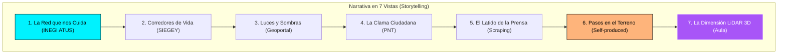

# Plan del Proyecto: Sentir la Calle (Data Storytelling Peatonal en Mérida)

## 📌 Descripción General
"Sentir la Calle" es una propuesta de **Data Storytelling interactivo** diseñada para el libro colectivo de la materia. El proyecto aborda la percepción de seguridad, accesibilidad y confort del peatón en Mérida, Yucatán, mediante una narrativa dividida en **7 Vistas (Capítulos)** que conectan 7 fuentes de datos de distintas escalas y culminan con la visualización tridimensional mediante **LiDAR escaneado en el aula**.

---

## 🎭 Estructura Narrativa de las 7 Vistas (Storytelling)

| Vista | Título del Capítulo / Fuente | Historia que Cuenta | Integrante Responsable |
|---|---|---|---|
| **1. La Red que nos Cuida** | INEGI (ATUS) — Nacional | Las cifras oficiales masivas de siniestralidad vial en Mérida y la magnitud del espacio urbano. | **Rivaldo** |
| **2. Corredores de Vida** | SIEGEY — Estatal | El flujo constante de miles de usuarios en las rutas metropolitanas *Va y Ven* e *Ie-Tram*. | **Elisabeth** |
| **3. Luces y Sombras** | Geoportal Mérida — Municipal | La presencia o ausencia de semáforos peatonales, alumbrado y banquetas en la ciudad. | **Elisabeth** |
| **4. La Clama Ciudadana** | PNT / SSP Yucatán — Transparencia | Lo que los vecinos solicitan formalmente: alumbrado, botones de pánico y cruceros prioritarios. | **Elisabeth** |
| **5. El Latido de la Prensa** | Web Scraping — Medios Locales | 192 publicaciones y testimonios en prensa sobre choques y la percepción cotidiana de riesgo. | **Christopher** |
| **6. Pasos en el Terreno** | Self-Produced — Auditoría de Campo | El contraste directo: tiempos de semáforo verde medidos a pie vs. la velocidad del tráfico real. | **Christopher** |
| **7. La Dimensión LiDAR 3D** | Sensor LiDAR — Captura en Aula | Inmersión 3D en la maqueta a escala del crucero para analizar **ángulos ciegos y campos de visión**. | **Rivaldo** |

---

## 👥 Asignación de Roles del Equipo

| Integrante | Rol en la Historia | Responsabilidades Clave |
|---|---|---|
| **Rivaldo** | **Coordinador Técnico & LiDAR / INEGI** | • Procesamiento de la nube de puntos 3D LiDAR (Vista 7). • Análisis de la fuente Nacional INEGI ATUS (Vista 1). • Arquitectura general de datos e indexación geoespacial. |
| **Elisabeth** | **Especialista Institucional & Transparencia** | • Extracción y seguimiento de peticiones PNT / SSP (Vista 4). • Análisis de corredores SIEGEY Va y Ven (Vista 2). • Mapeo de semáforos y banquetas en el Geoportal de Mérida (Vista 3). |
| **Christopher** | **Especialista de Campo & Scraping** | • Scraper de noticias y testimonios en prensa local (Vista 5). • Levantamiento presencial y encuesta de confort en campo (Vista 6). • Diseño visual y maquetación de gráficos para el libro/web. |

---

## 🗺️ Diagrama de Flujo del Storytelling Interactivo

---

## 🌐 Prototipo Interactivo
El sitio web interactivo al estilo UPY DataViz está disponible en el archivo [`index.html`](index.html), donde se puede navegar entre las 7 vistas con gráficos dinámicos en Chart.js y el visor 3D interactivo en Three.js.
