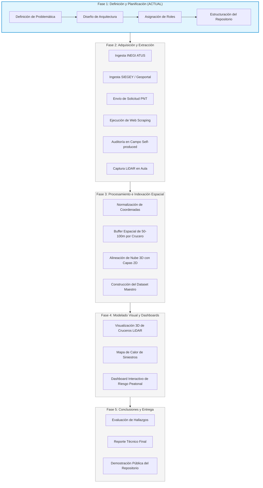

# Plan del Proyecto: Análisis Espacial 3D y Seguridad Peatonal en Intersecciones Viales de Mérida

## 📌 Descripción General
El objetivo de este proyecto es estudiar, modelar y visualizar la siniestralidad vial, accesibilidad peatonal y puntos críticos de conflicto vehicular en Mérida, Yucatán. Para lograrlo, integramos datos heterogéneos de escalas nacional, estatal, municipal, solicitudes de transparencia, web scraping, recolección en campo (self-produced) y modelado 3D mediante **LiDAR en aula**.

---

## 👥 Asignación de Roles y Responsabilidades

El equipo de trabajo está integrado por 3 integrantes con responsabilidades claras y complementarias:

| Integrante | Rol Principal | Responsabilidades Clave |
|---|---|---|
| **Rivaldo** | **Coordinador Técnico y Análisis Geoespacial / LiDAR** | • Arquitectura general de datos e indexación espacial (GIS / Coordenadas). • Procesamiento de nubes de puntos 3D LiDAR (adquisición en aula y exportación). • Gestión y mantenimiento del repositorio GitHub. • Integración de datos a nivel Nacional (INEGI ATUS). |
| **Elisabeth** | **Especialista en Datos Institucionales y Transparencia** | • Gestión y seguimiento de la solicitud de información pública (PNT / SSP Yucatán). • Extracción, limpieza y estructuración de datos estatales (SIEGEY / Va y Ven). • Catalogación de infraestructura semafórica y equipamiento vial del Geoportal de Mérida. • Documentación y diccionarios de datos del proyecto. |
| **Christopher** | **Especialista en Datos de Campo, Scraping y Visualización** | • Diseño y ejecución de la auditoría física de cruceros (Self-Produced Data). • Desarrollo y mantenimiento del pipeline de web scraping de medios informativos locales. • Creación de maquetas físicas o escenarios de prueba para escaneo LiDAR en aula. • Diseño e implementación de dashboards y visualizaciones interactivas finales. |

---

## 🗺️ Fases del Proyecto

### Detalle de Fases:
* **Fase 1: Definición y Planificación (📍 FASE ACTUAL)**
  * Selección de la problemática (Seguridad en cruceros peatonales e intersecciones críticas en Mérida).
  * Creación y configuración del repositorio oficial.
  * Definición de metodologías de adquisición y criterios de indexación espacial.
* **Fase 2: Adquisición y Extracción de Datos**
  * Descarga masiva y filtrado municipal de datos oficiales.
  * Ejecución de scrapers y captura de datos generados por el equipo.
  * Realización del escaneo láser 3D (LiDAR) del modelo a escala en el salón.
* **Fase 3: Limpieza, Procesamiento e Indexación**
  * Homogeneización de formatos (GeoJSON, CSV, PLY).
  * Georreferenciación y cruce espacial mediante radios de influencia por intersección vial.
* **Fase 4: Visualización y Modelado**
  * Generación de vistas interactivas (mapas geoespaciales 2D + nubes de puntos 3D).
  * Correlación entre aforo, infraestructura semafórica y siniestros históricos.
* **Fase 5: Documentación y Conclusiones**
  * Redacción del reporte de resultados y sustentación del proyecto.

---

## 📚 Principales Fuentes de Información

| Nivel / Tipo de Fuente | Origen Oficial | Descripción y Propósito |
|---|---|---|
| **Nacional** | **INEGI - ATUS** (*Accidentes de Tránsito Terrestre en Zonas Urbanas y Suburbanas*) | Registro estadístico anual de accidentes, involucrados, tipos de impacto y víctimas por municipio. |
| **Estatal** | **SIEGEY / Agencia de Transporte de Yucatán** | Datos operativos del sistema metropolitano *Va y Ven* y corredores de alta demanda (aforos, paraderos, rutas). |
| **Municipal** | **Geoportal Mérida / Infraestructura Urbana** | Catálogo geoespacial de semáforos viales, cruces señalizados y jerarquía de vialidades de la ciudad. |
| **Transparencia** | **PNT / SSP Yucatán (C5i)** | Solicitud formal de información sobre los cruceros con mayor índice de siniestralidad y reportes de atención del 911. |
| **Web Scraping** | **Medios de Comunicación Locales** | Monitoreo en medios digitales de incidentes viales recientes en avenidas principales y Anillo Periférico. |
| **Self-Produced** | **Auditoría Directa de Campo** | Levantamiento presencial de anchos de banqueta, tiempos de semáforo verde peatonal y aforos en horas pico. |
| **LiDAR en Aula** | **Sensor Láser 3D** | Escaneo tridimensional de una maqueta física a escala representativa de una intersección conflictiva para analizar visibilidad y obstáculos. |

---

## 🎯 Criterio de Indexación (Unión de Datos)
Todas las fuentes se conectan mediante un **índice espacial unificado**:
$$\text{Intersección Target} = (\text{Latitud}, \text{Longitud}) \pm \text{Buffer de Influencia (50m - 100m)}$$
Esto permite que cada punto de análisis contenga simultáneamente su geometría 3D, su historial de choques oficiales, sus menciones en prensa, su estado en semaforización y su auditoría física.
