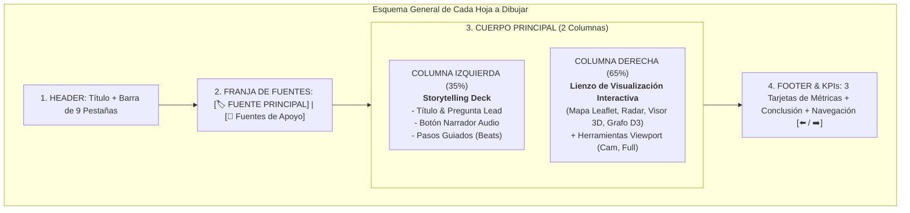

# Guía Maestra de Bocetaje y Wireframing a Mano: Prototipo de 9 Vistas
### *Manual para dibujar a mano el prototipo de Data Storytelling (Storyboards & Wireframes) - Sentir la Calle (Mérida UPY)*

---

## 🎨 Instrucciones Generales para el Dibujante a Mano

Esta guía está diseñada para que cualquier integrante del equipo (**Rivaldo, Elisabeth, Christopher**) pueda tomar hojas de papel (o tablet/iPad) y dibujar a mano alzada las **9 pantallas del prototipo**.

### Convenciones Visuales Recomendadas para el Dibujo:
- **Estructura Común (Layout Base en todas las hojas):**
  1. **Encabezado Superior (Header):** Título del proyecto ("Sentir la Calle • UPY") + Barra de pestañas navegables (9 botones).
  2. **Franja de Atribución de Fuentes:** 
     - Cuadro destacado a la izquierda: `[🏷️ FUENTE PRINCIPAL: <Nombre de la Fuente>]`
     - Texto a la derecha: `[🔗 Fuentes de Apoyo: <Fuente 2, Fuente 3>]`
  3. **Cuerpo Central Dividido en 2 Columnas:**
     - **Columna Izquierda (35% del ancho):** **Panel Editorial de Storytelling & Pasos Guiados** (Título, pregunta lead, narrador de audio, pasos guiados de análisis).
     - **Columna Derecha (65% del ancho):** **Área Principal de Visualización Interactiva** (Lienzo Leaflet, Diagrama Sankey, Radar, Visor 3D Three.js, Grafo D3, Holograma AR).
  4. **Pie de Pantalla (Footer):** Barra de KPIs (3 números grandes) + Insight Clave + Botones `[⬅️ Anterior / Siguiente ➡️]`.

---



---

## 📋 Detalle de las 9 Vistas para Dibujar a Mano

---

### 🖼️ HOJA 1: VISTA INEGI ATUS & DENUE
**Título en el dibujo:** `Vista 1: INEGI ATUS & DENUE — Sombras en las Cifras Oficiales`  
**Insignia de Fuentes:**  
- `[🏷️ FUENTE PRINCIPAL: INEGI (ATUS & DENUE 2020)]`  
- `[🔗 Fuentes de Apoyo: Microdatos ATUS Mérida, DENUE Cruces, Censo Manzanas]`

```text
+---------------------------------------------------------------------------------------+
| 🚶 DATA STORYTELLING: SENTIR LA CALLE | [1.INEGI] [2.Datos] [3.SIEGY] ...             |
+---------------------------------------------------------------------------------------+
| 🏷️ FUENTE PRINCIPAL: INEGI (ATUS & DENUE)     | 🔗 Fuentes: Microdatos ATUS, DENUE Cruces |
+-----------------------------------------------+---------------------------------------+
| [COLUMNA NARRATIVA 35%]                       | [LIENZO VISUALIZACIÓN 65%]            |
| - Título: Sombras en las Cifras Oficiales     | +-----------------------------------+ |
| - Lead: ¿Qué revela el registro oficial?      | | MAPA LEAFLET CLUSTERS DE SINIESTROS| |
| - Botón Escuchar Audio                        | | (7,134 puntos marcados en Mérida)  | |
| - Paso 1: Densidad Centro Histórico           | +-----------------------------------+ |
| - Paso 2: Nodos Periférico                    | [Herramientas: Captura | Pantalla]    |
+-----------------------------------------------+---------------------------------------+
| KPIs: [7,134 Siniestros]  [3,842 Comercios Expuestos]  [18 Zonas Críticas]            |
| 💡 Insight: Zonas comerciales registran 3.4 veces más percances peatonales.          |
+---------------------------------------------------------------------------------------+
```

---

### 🖼️ HOJA 2: VISTA DATOS.GOB.MX
**Título en el dibujo:** `Vista 2: Datos.gob.mx — La Curva de la Movilidad Peatonal`  
**Insignia de Fuentes:**  
- `[🏷️ FUENTE PRINCIPAL: Datos.gob.mx (Catálogo Nacional de Siniestros)]`  
- `[🔗 Fuentes de Apoyo: Base Viales Abiertos, Registro Movilidad]`

```text
+---------------------------------------------------------------------------------------+
| 🚶 DATA STORYTELLING: SENTIR LA CALLE | [1.INEGI] [2.Datos] [3.SIEGY] ...             |
+---------------------------------------------------------------------------------------+
| [NARRATIVA 35%]                               | [DIAGRAMA SANKEY & TENDENCIA 65%]     |
| - La Curva de la Movilidad Peatonal           | +-----------------------------------+ |
| - Lead: Comparativa Nacional vs. Yucatán      | | GRÁFICO SANKEY FLUSO MOVILIDAD   | |
| - Pasos: Olas de Siniestralidad y Horarios    | +-----------------------------------+ |
+-----------------------------------------------+---------------------------------------+
| KPIs: [642 veh/1k hab]  [72.4% Vulnerabilidad]  [68 km/h Velocidad Promedio]           |
+---------------------------------------------------------------------------------------+
```

---

### 🖼️ HOJA 3: VISTA SIEGY YUCATÁN
**Título en el dibujo:** `Vista 3: SIEGY Yucatán — El Latido Metropolitano (Va y Ven)`  
**Insignia de Fuentes:**  
- `[🏷️ FUENTE PRINCIPAL: SIEGY Yucatán & Agencia de Transporte ATY]`  
- `[🔗 Fuentes de Apoyo: Traza Va y Ven, Cohesión SIEGY, Matriz Origen-Destino]`

```text
+---------------------------------------------------------------------------------------+
| [NARRATIVA 35%]                               | [RADAR MULTIDIMENSIONAL 65%]          |
| - El Latido Metropolitano                     | +-----------------------------------+ |
| - Cohesión de Transporte & Paraderos          | | RADAR MULTIEJE SERVICIOS VA Y VEN | |
| - Tiempos de Caminata a Paradero              | +-----------------------------------+ |
+-----------------------------------------------+---------------------------------------+
| KPIs: [210,000 Usuarios Va y Ven]  [850m Caminata Promedio]  [34% Cobertura Sombra]   |
+---------------------------------------------------------------------------------------+
```

---

### 🖼️ HOJA 4: VISTA GEOPORTAL MÉRIDA
**Título en el dibujo:** `Vista 4: GeoPortal Mérida & OSM — La Ciudad a Escala Humana`  
**Insignia de Fuentes:**  
- `[🏷️ FUENTE PRINCIPAL: GeoPortal Mérida & OpenStreetMap Overpass]`  
- `[🔗 Fuentes de Apoyo: Capa GIS Banquetas, Inventario Semáforos, 80 Nodos OSM]`

```text
+---------------------------------------------------------------------------------------+
| [NARRATIVA 35%]                               | [MAPA LEAFLET 80 SEMÁFOROS 65%]       |
| - La Ciudad a Escala Humana                   | +-----------------------------------+ |
| - Inspección de 80 Nodos Semaforizados        | | MAPA CARTOGRÁFICO DE NODOS REALES | |
| - Fases Verdes de 14 Segundos                 | +-----------------------------------+ |
+-----------------------------------------------+---------------------------------------+
| KPIs: [80 Nodos Georeferenciados]  [14s Verde Promedio]  [51.2% Rampas Universal]      |
+---------------------------------------------------------------------------------------+
```

---

### 🖼️ HOJA 5: VISTA TRANSPARENCIA PNT
**Título en el dibujo:** `Vista 5: Transparencia PNT — Voces en el Papel`  
**Insignia de Fuentes:**  
- `[🏷️ FUENTE PRINCIPAL: PNT / SSP Yucatán]`  
- `[🔗 Fuentes de Apoyo: Solicitud PNT SSP, Buzón Municipal, C5i Radares]`

```text
+---------------------------------------------------------------------------------------+
| [NARRATIVA 35%]                               | [RAINCLOUD PLOTS & BARRAS PNT 65%]    |
| - Voces en el Papel                           | +-----------------------------------+ |
| - Oficios Vecinales y Solicitudes PNT         | | GRÁFICO HISTOGRAMA PETICIONES SSP | |
+-----------------------------------------------+---------------------------------------+
| KPIs: [142 Oficios PNT]  [44.3% Semáforos Peatonales]  [18 Días Respuesta]           |
+---------------------------------------------------------------------------------------+
```

---

### 🖼️ HOJA 6: VISTA WEB SCRAPING
**Título en el dibujo:** `Vista 6: Web Scraping — El Rumor Digital`  
**Insignia de Fuentes:**  
- `[🏷️ FUENTE PRINCIPAL: Web Scraping Prensa Local (Diario de Yucatán, Por Esto!)]`  
- `[🔗 Fuentes de Apoyo: Scraping Diario Yucatán, Mining Por Esto!, Redes #Periférico]`

```text
+---------------------------------------------------------------------------------------+
| [NARRATIVA 35%]                               | [GRAFO SEMÁNTICO DE FUERZAS D3 65%]   |
| - El Rumor Digital                            | +-----------------------------------+ |
| - Minería de Co-ocurrencia y Sentimiento      | | GRAFO DE NODOS Y PALABRAS CLAVE   | |
+-----------------------------------------------+---------------------------------------+
| KPIs: [854 Notas Minadas]  [68% Sentimiento Negativo]  [Cruces: Periférico & Chenkú]  |
+---------------------------------------------------------------------------------------+
```

---

### 🖼️ HOJA 7: VISTA SELF-PRODUCED UPY
**Título en el dibujo:** `Vista 7: Self-Produced UPY — La Voz del Terreno`  
**Insignia de Fuentes:**  
- `[🏷️ FUENTE PRINCIPAL: Auditoría de Campo UPY]`  
- `[🔗 Fuentes de Apoyo: Conteo Afluencia, Ancho Banqueta 1.2m, Confort 38°C]`

```text
+---------------------------------------------------------------------------------------+
| [NARRATIVA 35%]                               | [CALCULADORA & CONFORT TÉRMICO 65%]   |
| - La Voz del Terreno                          | +-----------------------------------+ |
| - Medición Presencial a Pie por UPY           | | BARRAS COMPARATIVAS ANCHO LIBRE   | |
+-----------------------------------------------+---------------------------------------+
| KPIs: [12 Cruces Auditados]  [58.3% Banquetas <1.20m]  [38.5°C Temperatura Campo]   |
+---------------------------------------------------------------------------------------+
```

---

### 🖼️ HOJA 8: VISTA LIDAR 3D
**Título en el dibujo:** `Vista 8: LiDAR 3D — El Ojo Digital 3D`  
**Insignia de Fuentes:**  
- `[🏷️ FUENTE PRINCIPAL: Sensor LiDAR 3D (Escaneo en Aula UPY)]`  
- `[🔗 Fuentes de Apoyo: Nube Puntos .PLY, Mapeo Ángulos Ciegos 3.5m, Perfil Rampas]`

```text
+---------------------------------------------------------------------------------------+
| [NARRATIVA 35%]                               | [VISOR 3D WEBGL THREE.JS 65%]         |
| - El Ojo Digital 3D                           | +-----------------------------------+ |
| - Nube de Puntos Volumétrica Cyberpunk        | | LIENZO 3D CON CONTROL ORBITAL     | |
| - Ángulos Ciegos de 3.5 Metros                | +-----------------------------------+ |
+-----------------------------------------------+---------------------------------------+
| KPIs: [125,000 Puntos LiDAR]  [3.5m Radio Ángulo Ciego]  [±2cm Precisión]            |
+---------------------------------------------------------------------------------------+
```

---

### 🖼️ HOJA 9: VISTA REALIDAD AUMENTADA (AR)
**Título en el dibujo:** `Vista 9: Realidad Aumentada (AR) — Inmersión Urbana`  
**Insignia de Fuentes:**  
- `[🏷️ FUENTE PRINCIPAL: Realidad Aumentada AR (WebXR / Modelado 3D)]`  
- `[🔗 Fuentes de Apoyo: Modelo Holográfico 3D, Filtro AR WebXR, Matriz Integrada]`

```text
+---------------------------------------------------------------------------------------+
| [NARRATIVA 35%]                               | [HOLOGRAMA 3D & PROYECCIÓN WEBXR 65%] |
| - Inmersión Urbana                            | +-----------------------------------+ |
| - Rediseño de Crucero Seguro                  | | MAQUETA HOLOGRÁFICA WEBXR         | |
| - Botón para Proyectar en Mesa con Móvil      | +-----------------------------------+ |
+-----------------------------------------------+---------------------------------------+
| KPIs: [Modelo WebXR Ready]  [+88% Seguridad Proyectada]  [-40% Velocidad Vehicular]   |
+---------------------------------------------------------------------------------------+
```
