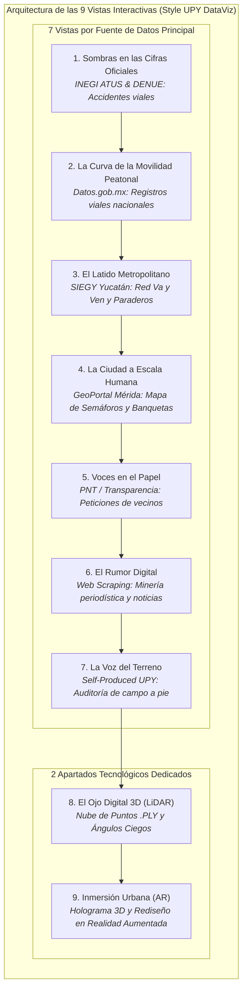
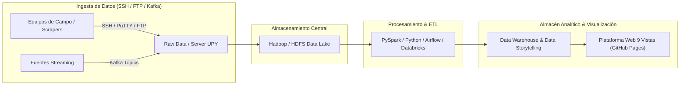

# Data Storytelling: Sentir la Calle
### *Un viaje interactivo desde la seguridad, el confort y la infraestructura peatonal en Mérida*

> 🌐 **Plataforma Web Interactiva (GitHub Pages):**  
> 👉 **[https://rivaldo2309030.github.io/Visual-Modeling-For-Information/](https://rivaldo2309030.github.io/Visual-Modeling-For-Information/)**

---

## 🌟 Descripción General del Proyecto

Este proyecto es una plataforma interactiva de **Data Storytelling y Visualización Avanzada de Datos** centrada en la percepción de seguridad, accesibilidad, infraestructura y confort del peatón en Mérida, Yucatán.

Estructuramos la experiencia en **9 Vistas / Pestañas Temáticas de Visualización Interactiva**:
- **7 Vistas guiadas por Fuentes de Datos Principales**, donde cada vista destaca una fuente titular enriquecida por fuentes complementarias.
- **2 Apartados Tecnológicos Especiales** dedicados a experiencias inmersivas: **LiDAR 3D** (medición de ángulos ciegos) y **Realidad Aumentada (AR)** (modelado inmersivo de cruceros seguros).

---

## 🧭 Arquitectura de las 9 Vistas de Visualización

---

## 📊 Matriz de Visualizaciones por Vista

| No. | Vista / Pestaña | Fuente Principal (Titular) | 3 Fuentes Complementarias Específicas | Experiencia Visual Compleja | Hilo de Storytelling |
| :---: | :--- | :--- | :--- | :--- | :--- |
| **1** | **Sombras en las Cifras Oficiales** | **INEGI** (ATUS & DENUE) | 1. Microdatos ATUS Mérida (2021-2023) 2. DENUE Comercio en Cruces 3. Censo Poblacional INEGI 2020 | **Explorador Cartográfico & Cluster de Siniestralidad** | *La Red Oficial:* Radiografía de los 7,134 percances registrados por el censo. |
| **2** | **La Curva de la Movilidad** | **Datos.gob.mx** | 1. Catálogo Nacional de Siniestros Viales 2. Base de Datos Viales Abiertos 3. Registro Nacional de Movilidad | **Diagrama Sankey de Rutas Peatonales vs. Tráfico** | *La Curva de Riesgo:* Flujo de peatones cruzando en avenidas de alta velocidad. |
| **3** | **El Latido Metropolitano** | **SIEGY Yucatán** | 1. Traza y Paraderos Va y Ven (ATY) 2. Cohesión Territorial SIEGY 3. Matriz Origen-Destino Periférico | **Radar Multidimensional & Mapa de Paraderos** | *El Latido del Transporte:* Congestión y tiempos de espera en el circuito metropolitano. |
| **4** | **La Ciudad a Escala Humana** | **GeoPortal Mérida** | 1. Capa GIS de Banquetas y Postes 2. Inventario de Semáforos Municipal 3. OpenStreetMap Mérida Overpass API | **Mapa Interactivo Leaflet (OSM/Esri) de Nodos** | *La Geometría del Barrio:* Geolocalización de 80 semáforos y banquetas en Mérida. |
| **5** | **Voces en el Papel** | **PNT / Transparencia** | 1. Solicitud PNT a SSP Yucatán (Cruces) 2. Buzón Municipal de Atención Ciudadana 3. Informes C5i Cámaras/Radares | **Raincloud Plots & Buzón Visual de Oficios** | *Héroes y Peticiones:* Oficios de ciudadanos solicitando alumbrado y semáforos peatonales. |
| **6** | **El Rumor Digital** | **Web Scraping Prensa** | 1. Scraping Notas Incidentes Viales (Diario de Yucatán) 2. Mining Prensa (Por Esto!) 3. Comentarios Redes (#PeriféricoPeligroso) | **Red de Co-ocurrencia Semántica & Nube de Sentimiento** | *El Eco de la Prensa:* Percepción periodística y sentimiento sobre cruces peligrosos. |
| **7** | **La Voz del Terreno** | **Self-Produced Data** (Auditoría UPY) | 1. Medición Presencial de Afluencia y Verde 2. Auditoría Física de Ancho de Banqueta (1.2m) 3. Encuestas de Confort Térmico (38°C) | **Calculadora de Huellas y Medidor de Confort** | *La Voz Universitaria:* Pasos reales medidos a pie y corte de tiempo verde en semáforos. |
| **8** | **El Ojo Digital 3D (LiDAR)** | **Sensor LiDAR 3D** | 1. Nube de Puntos 3D .PLY (Maqueta 1:50) 2. Mapeo de Punto Ciego Muros/Arbustos (3.5m) 3. Perfil de Relieve e Infraestructura 3D | **Visor 3D Interactivo Three.js de Ángulos Ciegos** | *Morfología 3D:* Simulación láser de puntos ciegos entre vehículos y peatones. |
| **9** | **Inmersión Urbana (AR)** | **Realidad Aumentada (AR)** | 1. Modelo 3D Holográfico de Crucero Seguro 2. Filtro AR WebXR de Cruce Re-diseñado 3. Matriz Integrada por Coordenadas | **Holograma Interactivo AR & Maqueta Inmersiva** | *El Futuro Peatonal:* Propuesta interactiva en Realidad Aumentada para rediseño urbano. |

---

## 🏗️ Arquitectura de Ingesta y Procesamiento de Datos (Enterprise Data Lake)

---

## 👥 Equipo de Trabajo y Roles

| Integrante | Rol en la Historia | Responsabilidades Clave |
|---|---|---|
| **Rivaldo** | **Coordinador Técnico & LiDAR / INEGI** | • Procesamiento de la nube de puntos 3D LiDAR (Vista 8) y modelado 3D. • Análisis de la fuente Nacional INEGI ATUS (Vista 1). • Arquitectura general de datos e indexación geoespacial. |
| **Elisabeth** | **Especialista Institucional & Transparencia** | • Extracción y seguimiento de peticiones PNT / SSP (Vista 4). • Análisis de corredores SIEGEY Va y Ven (Vista 2). • Mapeo de semáforos y banquetas en el Geoportal de Mérida (Vista 3). |
| **Christopher** | **Especialista de Campo & Scraping** | • Scraper de noticias y testimonios en prensa local (Vista 5). • Levantamiento presencial y encuesta de confort en campo (Vista 6). • Análisis ambiental de clima/horarios (Vista 7) y diseño visual. |

---

## 🌐 Prototipo Web Interactivo
Accede al prototipo navegable con **9 Vistas estilo UPY DataViz** en:  
🔗 **[https://rivaldo2309030.github.io/Visual-Modeling-For-Information/](https://rivaldo2309030.github.io/Visual-Modeling-For-Information/)** o directamente en el archivo local [`index.html`](index.html).
