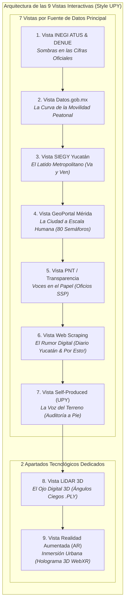

# Data Storytelling: Sentir la Calle
### *Un viaje interactivo desde la seguridad, el confort y la infraestructura peatonal en Mérida*

> 🌐 **Plataforma Web Interactiva (GitHub Pages):**  
> 👉 **[https://rivaldo2309030.github.io/Visual-Modeling-For-Information/](https://rivaldo2309030.github.io/Visual-Modeling-For-Information/)**

---

## 🌟 Descripción General del Proyecto

Este proyecto es una plataforma interactiva de **Data Storytelling y Visualización Avanzada de Datos** centrada en la resiliencia, seguridad, accesibilidad e infraestructura del peatón en Mérida, Yucatán y la UPY.

A diferencia de reportes estáticos con gráficas convencionales, la plataforma se estructura en **9 Vistas / Pestañas Temáticas de Visualización Interactiva**:
- **7 Vistas guiadas por Fuentes de Datos Principales**, donde cada vista tiene una fuente titular destacada que se enriquece de forma complementaria con las demás fuentes.
- **2 Apartados Tecnológicos Especiales** dedicados a experiencias inmersivas: **LiDAR 3D** y **Realidad Aumentada (AR)**, generados a partir de los datos espaciales, demográficos y ambientales de las fuentes anteriores.

---

## 🧭 Arquitectura de las 9 Vistas de Visualización



---

## 📊 Matriz de Visualizaciones por Vista

| No. | Vista / Pestaña | Fuente Principal (Titular) | Fuentes Complementarias | Experiencia Visual Compleja | Hilo de Storytelling |
| :---: | :--- | :--- | :--- | :--- | :--- |
| **1** | **INEGI ATUS & DENUE** | **INEGI** (ATUS & DENUE 2020) | Microdatos ATUS, DENUE Cruces, Censo 2020 | **Explorador Cartográfico con Clusters Dinámicos** | *Sombras en las Cifras Oficiales:* Radiografía de 7,134 percances en zonas comerciales expuestas. |
| **2** | **Datos.gob.mx** | **Datos.gob.mx** (Catálogo Siniestros Viales) | Base Viales Abiertos, Registro Movilidad | **Diagrama de Sankey Dinámico + Curva de Tendencias** | *La Curva de la Movilidad:* Flujos peatonales vs. tasa de motorización urbana. |
| **3** | **SIEGY Yucatán** | **SIEGY** (Gobierno del Estado de Yucatán) | Traza Va y Ven, Cohesión SIEGY, Matriz Periférico | **Radar Multidimensional & Mapa de Paraderos Va y Ven** | *El Latido Metropolitano:* Tiempos de caminata y cobertura de sombra en paraderos metropolitana. |
| **4** | **GeoPortal Mérida** | **GeoPortal Ayuntamiento de Mérida** | Capa GIS Banquetas, Inventario Semáforos, OSM 80 Nodos | **Mapa Cartográfico Interactivo Leaflet de 80 Nodos** | *La Ciudad a Escala Humana:* Tiempos verdes en semáforos (14 seg) y velocidad requerida para cruzar. |
| **5** | **PNT / Transparencia** | **Plataforma Nacional de Transparencia (PNT)** | Solicitud PNT SSP Yucatán, Buzón Municipal, C5i | **Raincloud Plots & Matriz de Respuestas Institucionales** | *Voces en el Papel:* Análisis de 142 peticiones vecinales demandando semáforos peatonales. |
| **6** | **Web Scraping** | **Web Scraping Prensa** (Diario de Yucatán, Por Esto!) | Scraping Diario Yucatán, Mining Por Esto!, Redes #Periférico | **Red de Co-ocurrencia Semántica (D3 Force) & Sentimiento** | *El Rumor Digital:* Minería de más de 850 notas periodísticas y sentimiento ciudadano. |
| **7** | **Self-Produced Data** | **Auditoría de Campo UPY** (Levantamiento propio) | Conteo Afluencia, Ancho Banqueta 1.2m, Confort 38°C | **Calculadora de Huella Peatonal & Medidor de Confort** | *La Voz del Terreno:* Mediciones a pie por estudiantes UPY revelando banquetas estrechas (<1.2m). |
| **8** | **LiDAR 3D** | *Sensor LiDAR 3D en Aula (Maqueta a escala 1:50)* | Nube Puntos .PLY, Mapeo Ángulos Ciegos 3.5m, Perfil Rampas | **Maqueta 3D Volumétrica Interactiva (Three.js WebGL)** | *El Ojo Digital 3D:* Simulación láser de cono de visión y bloqueos por muros y vegetación. |
| **9** | **Realidad Aumentada (AR)**| *WebXR / Modelado 3D de Crucero Seguro* | Modelo Holográfico 3D, Filtro AR WebXR, Matriz Integrada | **Holograma Interactivo 3D y Experiencia WebXR en AR** | *Inmersión Urbana:* Proyección en Realidad Aumentada de un cruce re-diseñado sobre el escritorio. |

---

## 👥 Asignaciones del Equipo para Carga de Datos (`/data`)

Cada visualización cuenta con su propia carpeta dentro de [`data/`](data/) dividida en **Fuente Origen** y al menos **Dos Fuentes Extras** de cruce:

| Integrante | Módulos Asignados | Carpetas de Datos | Tipos de Datos Soportados |
| :--- | :--- | :--- | :--- |
| **Elisabeth** | 1. INEGI ATUS & DENUE<br>2. Datos.gob.mx<br>3. SIEGY Yucatán | [`data/01_inegi_denue/`](data/01_inegi_denue)<br>[`data/02_datos_gob/`](data/02_datos_gob)<br>[`data/03_siegy_yucatan/`](data/03_siegy_yucatan) | `CSV`, `GeoJSON`, `API REST`, `XLSX` |
| **Christopher** | 4. GeoPortal Mérida<br>6. Web Scraping Prensa<br>7. Self-Produced UPY | [`data/04_geoportal_merida/`](data/04_geoportal_merida)<br>[`data/06_web_scraping/`](data/06_web_scraping)<br>[`data/07_self_produced_upy/`](data/07_self_produced_upy) | `GeoJSON`, `Shapefile`, `JSON`, `CSV` (Scraping & Forms) |
| **Rivaldo** | 5. Transparencia PNT<br>8. LiDAR 3D<br>9. Realidad Aumentada (AR) | [`data/05_transparencia_pnt/`](data/05_transparencia_pnt)<br>[`data/08_lidar_3d/`](data/08_lidar_3d)<br>[`data/09_realidad_aumentada_ar/`](data/09_realidad_aumentada_ar) | `CSV`, `GeoTIFF`, `PLY/XYZ`, `GLTF/GLB`, `JSON` |

---

## 🏗️ Arquitectura Modular del Código

El proyecto sigue una estructura limpia, escalable y desacoplada basada en módulos ES6, hojas de estilo y repositorio estructurado de datos:

```
Visual-Modeling-For-Information/
├── data/                               # Repositorio central de datasets crudos y procesados
│   ├── 01_inegi_denue/                 # [Elisabeth] Fuente Origen INEGI + 2 Extras (DENUE, Censo)
│   ├── 02_datos_gob/                   # [Elisabeth] Fuente Origen Datos.gob + 2 Extras (Viales, Movilidad)
│   ├── 03_siegy_yucatan/               # [Elisabeth] Fuente Origen SIEGY + 2 Extras (Va y Ven, Matriz OD)
│   ├── 04_geoportal_merida/            # [Christopher] Fuente Origen GeoPortal + 2 Extras (Semáforos, OSM 80 Nodos)
│   ├── 05_transparencia_pnt/           # [Rivaldo] Fuente Origen PNT + 2 Extras (Buzón Municipal, C5i)
│   ├── 06_web_scraping/                # [Christopher] Fuente Origen Prensa Scraped + 2 Extras (Redes, Gacetas)
│   ├── 07_self_produced_upy/           # [Christopher] Fuente Origen Auditoría UPY + 2 Extras (Banquetas, Confort)
│   ├── 08_lidar_3d/                    # [Rivaldo] Fuente Origen Nube LiDAR 3D + 2 Extras (Ángulos Ciegos, Rampas)
│   ├── 09_realidad_aumentada_ar/       # [Rivaldo] Fuente Origen Holograma 3D + 2 Extras (WebXR, Matriz)
│   └── README.md                       # Matriz general y guía de formatos de datos
├── index.html                          # Punto de entrada HTML semántico y limpio
├── prototipo_digital.html              # Redirección de compatibilidad a index.html
├── css/
│   ├── style.css                       # Variables de diseño, reset, paleta y layout
│   ├── components.css                  # Header, pestañas, botones, tarjetas KPI, modal <dialog> y toasts
│   └── visualizations.css              # Lienzos de canvas, mapa GIS SVG, visor 3D y superposiciones
├── js/
│   ├── data/
│   │   └── viewsData.js                # Dataset estructurado de las 9 vistas (fuentes, KPIs, datos)
│   ├── modules/
│   │   ├── gisMap.js                   # Renderizador de mapa cartográfico interactivo GIS
│   │   ├── charts.js                   # Controlador Chart.js (líneas, barras, radar multieje)
│   │   ├── forceGraph.js               # Simulación de física de fuerzas para grafo semántico
│   │   ├── threeVisuals.js             # Entorno 3D WebGL (LiDAR y AR molecular con OrbitControls)
│   │   └── storytelling.js             # Narración por voz (Web Speech API), Auto-Tour y notificaciones
│   └── app.js                          # Coordinador central de la aplicación y eventos del DOM
├── FUENTES_Y_PLAN_DE_ANALISIS.md       # Metodología exhaustiva y fuentes de datos
└── PROTOTIPO_BORRADOR_WIREFRAMES.md    # Wireframes y borradores de diseño
```

---

## 🎨 Principios de Diseño e Interacción
- **View Transitions API:** Transiciones fluidas nativas entre vistas temáticas.
- **Narración Auditiva:** Soporte para lectura en voz alta con Web Speech API.
- **Interacción 3D Completa:** OrbitControls para rotar, acercar y panear la maqueta de nube de puntos LiDAR.
- **Storytelling Progresivo:** Hilo conductor humano desde la perspectiva macro (Mérida y Periférico) hasta la micro (banquetas, semáforos y confort térmico a 38°C).
- **Estética de Vanguardia:** Paleta con gradientes, soporte glassmorphism y micro-interacciones responsivas.
