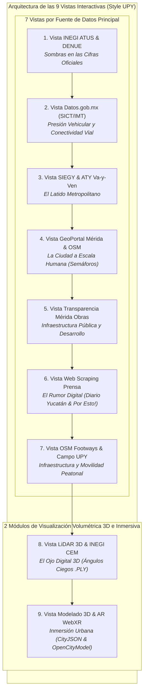

# Data Storytelling: Sentir la Calle
### *Un viaje interactivo desde la seguridad, el confort y la infraestructura peatonal en Mérida*

> 🌐 **Plataforma Web Interactiva (GitHub Pages):**  
> 👉 **[https://rivaldo2309030.github.io/Visual-Modeling-For-Information/](https://rivaldo2309030.github.io/Visual-Modeling-For-Information/)**

---

## 🌟 Descripción General del Proyecto

Este proyecto es una plataforma interactiva de **Data Storytelling y Visualización Avanzada de Datos** centrada en la accesibilidad, seguridad vial, confort térmico e infraestructura del peatón en Mérida, Yucatán.

La plataforma se estructura en **9 Vistas / Pestañas Temáticas de Visualización Interactiva**:
- **7 Vistas guiadas por Fuentes de Datos Principales**, analizando datasets específicos enriquecidos por fuentes secundarias.
- **2 Módulos Tecnológicos e Inmersivos** dedicados a la volumetría 3D y la síntesis urbana: **LiDAR 3D** (escaneo de elevación y ángulos ciegos) y **Realidad Aumentada (AR)** (proyección holográfica WebXR de rediseño urbano basada en CityJSON Rotterdam y datasets 3D urbanos).

---

## 🧭 Arquitectura de las 9 Vistas de Visualización

---

## 📊 Matriz de Visualizaciones por Vista

| No. | Vista / Pestaña | Fuente Principal (Origen) | Fuentes Secundarias de Apoyo | Experiencia Visual Compleja | Hilo de Storytelling |
| :---: | :--- | :--- | :--- | :--- | :--- |
| **1** | **INEGI ATUS & DENUE** | **INEGI** (ATUS Accidentes & DENUE Comercio) | Microdatos ATUS Mérida, DENUE Cruces, Censo Manzanas | **Explorador Cartográfico con Clusters Dinámicos** | *Sombras en las Cifras Oficiales:* Radiografía de 7,134 percances en zonas comerciales expuestas. |
| **2** | **SICT / IMT Viales** | **Datos.gob.mx** (SICT Datos Viales & IMT) | Base Viales Abiertos SICT, Red Nacional Caminos | **Diagrama de Sankey Dinámico + Curva de Tendencias** | *Presión Vehicular y Conectividad:* Flujos vehiculares vs. infraestructura peatonal. |
| **3** | **SIEGY Yucatán** | **SIEGY Yucatán & ATY** (Rutas Va-y-Ven) | Traza Va-y-Ven ATY, Cohesión SIEGY, Matriz Periférico | **Radar Multidimensional & Mapa de Paraderos Va-y-Ven** | *El Latido Metropolitano:* Tiempos de caminata y cobertura de sombra en paraderos del sistema metropolitano. |
| **4** | **GeoPortal Mérida** | **GeoPortal Mérida & OpenStreetMap** | Capa GIS Banquetas, Inventario Semáforos, Nodos OSM | **Mapa Cartográfico Interactivo Leaflet de Semáforos** | *La Ciudad a Escala Humana:* Tiempos verdes en semáforos (14 seg promedio) y velocidad requerida para cruzar. |
| **5** | **Infraestructura Mérida** | **Ayuntamiento de Mérida** (Infraestructura Abierta & Obras) | Infraestructura Abierta Mérida, Obras Realizadas, Contratos | **Raincloud Plots & Matriz de Contrataciones Abiertas** | *Infraestructura Pública:* Análisis de contratos y ejecución de obras viales municipales. |
| **6** | **Web Scraping** | **Prensa Local (Hemerografía)** (Diario de Yucatán, Por Esto!) | Minería Diario de Yucatán, Mining Por Esto!, Boletines Prensa | **Red de Co-ocurrencia Semántica (D3 Force) & Sentimiento** | *El Rumor Digital:* Minería semántica de notas periodísticas y percepción ciudadana sobre cruces críticos. |
| **7** | **Movilidad Peatonal** | **OpenStreetMap Overpass & Auditoría UPY** | OSM Footways Mérida, OSM Crossings Mérida, Campo UPY | **Calculadora de Huella Peatonal & Medidor Térmico** | *Infraestructura y Movilidad Peatonal:* Red espacial de banquetas, cruces y validación física a pie. |
| **8** | **LiDAR 3D** | **INEGI CEM LiDAR + Waymo / ApolloScape** | INEGI MDE 1.5m, Waymo Open Perception, ApolloScape LiDAR | **Maqueta 3D Volumétrica Interactiva (Three.js WebGL)** | *El Ojo Digital 3D:* Simulación láser del cono de visión del conductor y bloqueos por elementos urbanos. |
| **9** | **Modelado 3D & AR**| **DLR Urban Intersection + CityJSON Rotterdam** | DLR Zenodo Intersection, CityJSON 3D Cities, OpenCityModel 3D | **Holograma Interactivo 3D y Experiencia WebXR en AR** | *Inmersión Urbana:* Proyección en Realidad Aumentada de un cruce re-diseñado a escala 1:1 sobre el escritorio. |

---

> ⚠️ **Nota sobre Subtema 7 (`07_self_produced_upy`):** Los datos de `07_self_produced` en `synthetic/` son simulados y se usan solo para validar el pipeline. Serán sustituidos por las respuestas reales del formulario.

---

## 👥 Asignaciones del Equipo para Carga de Datos (`/data`)

| Integrante | Módulos Asignados | Carpetas del Repositorio | Tipos de Datos Soportados |
| :--- | :--- | :--- | :--- |
| **Elisabeth** | 1. INEGI ATUS & DENUE 2. Presión Vehicular SICT/IMT 3. SIEGY Yucatán & ATY | [`data/01_inegi_denue/`](data/01_inegi_denue) [`data/02_datos_gob/`](data/02_datos_gob) [`data/03_siegy_yucatan/`](data/03_siegy_yucatan) | `CSV`, `GeoJSON`, `API REST`, `XLSX` |
| **Christopher** | 4. GeoPortal Mérida & OSM 6. Web Scraping Prensa 7. OSM Footways & Campo UPY | [`data/04_geoportal_merida/`](data/04_geoportal_merida) [`data/06_web_scraping/`](data/06_web_scraping) [`data/07_self_produced_upy/`](data/07_self_produced_upy) | `GeoJSON`, `Shapefile`, `JSON`, `CSV` |
| **Rivaldo** | 5. Infraestructura Pública Mérida 8. LiDAR 3D & CEM INEGI 9. Modelado 3D & AR WebXR | [`data/05_transparencia_pnt/`](data/05_transparencia_pnt) [`data/08_lidar_3d/`](data/08_lidar_3d) [`data/09_realidad_aumentada_ar/`](data/09_realidad_aumentada_ar) | `CSV`, `GeoTIFF`, `PLY/XYZ`, `CityJSON`, `JSON` |
